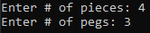
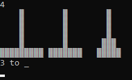
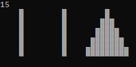
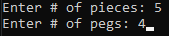
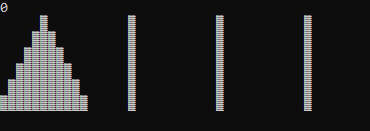
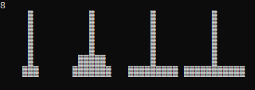
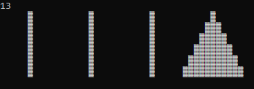

# Towers of Hanoi









# FAQ
[What is Towers of Hanoi?](https://en.wikipedia.org/wiki/Tower_of_Hanoi)

# Install for windows
1. Download zip to Desktop
2. [Stuff needed for gcc/g++](https://iweb.dl.sourceforge.net/project/tdm-gcc/TDM-GCC%20Installer/tdm64-gcc-5.1.0-2.exe) run & install
3. Press together: ```Win + R```
4. type & enter: ```cmd```
5. type & enter: ```cd Desktop``` to **c**hange **d**irectory to your Desktop
6. type & enter: ```cd TowersOfHanoi```
7. type & enter: ```g++ main.cpp -o run```
8. type & enter: ```run```

# How to play  
1. **Setup**
    * You are asked how many pieces & pegs you want to play with.
    * You may pick (1 - too many) pieces
    * You may pick (1 - 9) pegs
2. **Movement**:
    * Pegs are considered numbered from left to right, starting at 1
        - First number entered represents the peg from which you are taking the top piece
        - Second number entered represents the peg from which you place the taken piece 
3. **Objective**
    * Move the stack of pieces from the far left peg to the far right peg
3. **Notes**
    * The number of moves it takes to win grows exponentially as you play with more pieces