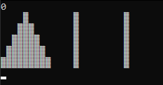

# Towers of Hanoi




# FAQ
* [What is Towers of Hanoi?](https://en.wikipedia.org/wiki/Tower_of_Hanoi)(Ctrl + click) the link
* Does this work on Linux?
    - Sadly no, due to libraries used in the code.
* Does this work on Windows
    - Yes, below instructions are provided.

# Install for windows
1. Download zip to Downloads
2. Unzip TowersOfHanoi-master
    * right-click & extract all in the same location
3. [Stuff needed for gcc/g++](https://iweb.dl.sourceforge.net/project/tdm-gcc/TDM-GCC%20Installer/tdm64-gcc-5.1.0-2.exe)(Ctrl + click) the link
    * run & install
    * Video on how to install the compilers [Compiler Installation Tutorial](www.youtube.com/vhgww2hvyq9jpyp)(Ctrl + click) the link
    * If you have installed them once, you don't need to again
4. Press together: ```Win + R```
5. type & enter: ```cmd```
6. type & enter: ```cd Downloads``` to **c**hange **d**irectory to your Downloads
7. type & enter: ```cd TowersOfHanoi-master```
8. Once more type & enter: ```cd TowersOfHanoi-master```
9. type & enter: ```g++ main.cpp -o run```
10. Read ```How to play``` before playing
11. type & enter: ```run```

# How to play  
1. **Setup**
    * You are asked how many pieces & pegs you want to play with.
    * You may pick (1 - too many) pieces
    * You may pick (1 - 9) pegs
2. **Movement**:
    * Pegs are considered numbered from left to right, starting at 1
        - First number entered represents the peg from which you are taking the top piece
        - Second number entered represents the peg from which you place the taken piece 
3. **Objective**
    * Move the stack of pieces from the far left peg to the far right peg
3. **Notes**
    * The number of moves it takes to win grows exponentially as you play with more pieces